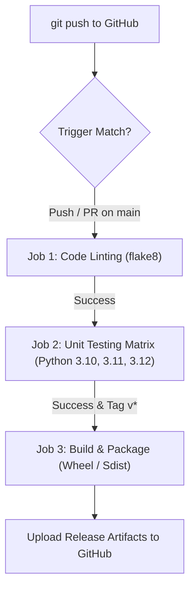

# The Complete Git, GitHub & CI/CD Master Guide
### A Practical, Real-World Walkthrough Using the `git-cicd-retail-hub` Project

Welcome to the definitive guide to Git, GitHub, and CI/CD automation. Every single concept and command in this document is demonstrated using our real-world retail pricing engine project: **`git-cicd-retail-hub`**.

---

## Table of Contents
1. [Core Mental Model: Git vs. GitHub](#1-core-mental-model-git-vs-github)
2. [The 4 Architecture Zones of Git](#2-the-4-architecture-zones-of-git)
3. [The Project Overview: `git-cicd-retail-hub`](#3-the-project-overview-git-cicd-retail-hub)
4. [Step-by-Step Practical Demonstration of Every Git Command](#4-step-by-step-practical-demonstration-of-every-git-command)
   - [Phase 1: Setup, Initialization & First Snapshot](#phase-1-setup-initialization--first-snapshot)
   - [Phase 2: File Tracking, Staging & Commits](#phase-2-file-tracking-staging--commits)
   - [Phase 3: Inspecting History & Code Differences](#phase-3-inspecting-history--code-differences)
   - [Phase 4: Branching & Isolated Feature Development](#phase-4-branching--isolated-feature-development)
   - [Phase 5: Emergency Interruptions & Stashing](#phase-5-emergency-interruptions--stashing)
   - [Phase 6: Merging, Rebasing & Conflict Resolution](#phase-6-merging-rebasing--conflict-resolution)
   - [Phase 7: Time Travel & Undoing Mistakes](#phase-7-time-travel--undoing-mistakes)
   - [Phase 8: Connecting to GitHub & Remote Collaboration](#phase-8-connecting-to-github--remote-collaboration)
   - [Phase 9: Version Tagging & Releases](#phase-9-version-tagging--releases)
   - [Phase 10: The Ultimate Safety Net: `git reflog`](#phase-10-the-ultimate-safety-net-git-reflog)
5. [GitHub Actions CI/CD Pipeline Deep Dive](#5-github-actions-cicd-pipeline-deep-dive)
6. [Complete Git Command Master Reference Table](#6-complete-git-command-master-reference-table)

---

## 1. Core Mental Model: Git vs. GitHub

| Concept | **Git** | **GitHub** |
| :--- | :--- | :--- |
| **Definition** | A local, distributed Version Control System (VCS). | A cloud platform that hosts Git repositories with collaboration tools. |
| **Where it runs** | On your computer terminal. Works 100% offline. | On cloud servers (Microsoft Azure). Requires internet access. |
| **Primary Job** | Tracks line-by-line file changes, snapshots history, switches branches. | Code reviews, Pull Requests (PRs), Issue tracking, CI/CD automation. |
| **Key Metaphor** | Your local camera taking snapshots of code over time. | The online photo gallery where your team shares and reviews snapshots. |

---

## 2. The 4 Architecture Zones of Git

Files move through 4 distinct zones during development:

```
 ┌──────────────────────┐
 │ 1. Working Directory │  Real files on your disk (untracked / modified)
 └──────────┬───────────┘
            │  git add <file>        (Stages changes)
            ▼
 ┌──────────────────────┐
 │ 2. Staging Area      │  The "Index" where you draft your next snapshot
 └──────────┬───────────┘
            │  git commit -m "..."   (Saves permanent snapshot)
            ▼
 ┌──────────────────────┐
 │ 3. Local Repository  │  Hidden .git/ database storing all historical commits
 └──────────┬───────────┘
            │  git push origin main  (Uploads commits)
            ▼
 ┌──────────────────────┐
 │ 4. Remote (GitHub)   │  The central cloud copy shared with team & CI/CD
 └──────────────────────┘
```

---

## 3. The Project Overview: `git-cicd-retail-hub`

Our project represents an enterprise checkout calculation microservice located at:
`c:\Users\2869026\Desktop\visual\git-cicd-retail-hub`

```
git-cicd-retail-hub/
├── .github/
│   └── workflows/
│       └── ci-cd.yml          <-- GitHub Actions CI/CD automation
├── src/
│   └── retail_calc.py         <-- Business logic (subtotals, coupons, tax, bulk discounts)
├── tests/
│   └── test_retail_calc.py    <-- Automated unit test suite
├── .gitignore                 <-- Protects secrets (.env) and Python bytecode
├── requirements.txt           <-- Tooling dependencies (flake8, build)
└── README.md                  <-- Project documentation & badges
```

---

## 4. Step-by-Step Practical Demonstration of Every Git Command

---

### Phase 1: Setup, Initialization & First Snapshot

#### `git config` — Setting Developer Identity
Before making commits, Git must know who is making the snapshot so that credit is attributed properly on GitHub.

```bash
# Set your name and email globally on your system
git config --global user.name "Alice Developer"
git config --global user.email "alice@example.com"

# Set the modern default branch name to 'main'
git config --global init.defaultBranch main

# Verify configuration settings
git config --list
```
*Why in our project*: When Alice commits code to `retail_calc.py`, her name and email are permanently stamped onto the commit.

---

#### `git init` — Creating the Repository
```bash
# Navigate to the project folder and initialize Git
cd c:\Users\2869026\Desktop\visual\git-cicd-retail-hub
git init
```
*What it does*: Creates a hidden folder `.git/` containing the object database, staging index, and branch pointers. Your folder is now a Git repository.

---

#### `.gitignore` — Protecting Secrets & Cleanliness
Certain files must **never** be committed to Git (e.g., database passwords, virtual environments, compiled caches).
We create a `.gitignore` file:
```gitignore
# Python compilation artifacts
__pycache__/
*.pyc

# Environment secrets
.env

# Virtual environments
venv/
.venv/
```
*Why in our project*: Prevents Python compiled `.pyc` files and sensitive API keys in `.env` from accidentally being published to GitHub.

---

### Phase 2: File Tracking, Staging & Commits

#### `git status` — Checking Working Tree Health
```bash
git status
```
*Sample Output*:
```text
On branch main
Untracked files:
  (use "git add <file>..." to include in what will be committed)
	.gitignore
	requirements.txt
	src/retail_calc.py
	tests/test_retail_calc.py

nothing added to commit but untracked files present
```
*What it does*: Tells you:
1. What branch you are currently on (`main`).
2. Which files are modified but unstaged.
3. Which files are untracked (new).

---

#### `git add` — Staging Changes
`git add` does **not** commit code; it moves files from the Working Directory into the **Staging Area (Index)**, drafting what will go into the next commit.

```bash
# Stage a specific file
git add src/retail_calc.py

# Stage all project files at once
git add .
```
*Check status after staging*:
```bash
git status
```
*Output*:
```text
Changes to be committed:
  (use "git restore --staged <file>..." to unstage)
	new file:   .gitignore
	new file:   src/retail_calc.py
	new file:   tests/test_retail_calc.py
```

---

#### `git add -p` — Interactive Patch Staging
```bash
git add -p src/retail_calc.py
```
*What it does*: If you made 3 different edits to `retail_calc.py` (e.g., a bug fix and an unfinished experiment), Git prompts you `Stage this hunk [y,n,q,a,d,s,e]?`. You can type `y` (yes) to stage only the bug fix and leave the experiment unstaged.

---

#### `git commit` — Recording Permanent Snapshots
```bash
git commit -m "feat: initial commit with retail calculation engine and unit tests"
```
*Output*:
```text
[main (root-commit) 7e962ac] feat: initial commit with retail calculation engine and unit tests
 4 files changed, 142 insertions(+)
 create mode 100644 .gitignore
 create mode 100644 src/retail_calc.py
 create mode 100644 tests/test_retail_calc.py
```
*What it does*: Packages everything currently in the Staging Area into a cryptographically hashed commit object (`7e962ac`), records the author and timestamp, and moves the branch pointer forward.

---

### Phase 3: Inspecting History & Code Differences

#### `git diff` — Viewing Unstaged Modifications
Let's edit `src/retail_calc.py` to add a new sales tax rate for California (`CA: 0.0925`).

```bash
git diff
```
*Output*:
```diff
diff --git a/src/retail_calc.py b/src/retail_calc.py
--- a/src/retail_calc.py
+++ b/src/retail_calc.py
@@ -30,2 +30,3 @@
         "TX": 0.0825,
+        "CA": 0.0925,
```
*What it does*: Compares your modified files on disk against the last commit. Green lines (`+`) show additions; red lines (`-`) show deletions.

---

#### `git diff --staged` — Viewing Staged Modifications
Once you run `git add src/retail_calc.py`, `git diff` shows nothing because changes are now staged. To inspect what is staged:
```bash
git diff --staged
```
*What it does*: Compares the Staging Area against the previous commit, allowing you to double-check your changes before committing.

---

#### `git log` — Reading Commit History
```bash
# Standard detailed log
git log

# Compact one-line visual tree graph (most popular command in production)
git log --oneline --graph --all
```
*Output*:
```text
* d79f812 (HEAD -> main) feat: add bulk volume tier discount
* 7e962ac feat: initial commit with retail calculation engine
```

---

#### `git show` — Inspecting a Specific Commit
```bash
git show d79f812
```
*What it does*: Shows author information, date, full commit message, and the exact code diff introduced by commit `d79f812`.

---

#### `git blame` — Auditing Code Authorship
```bash
git blame src/retail_calc.py
```
*What it does*: Prints every line of `src/retail_calc.py` prefixed with the commit hash, author name, and date who last touched that line. Invaluable for finding who introduced a bug or understanding why a decision was made.

---

### Phase 4: Branching & Isolated Feature Development

In professional teams, **nobody commits directly to `main`**. Developers create isolated feature branches.

#### `git branch` — Listing & Creating Branches
```bash
# List all local branches (the * shows the active branch)
git branch
```
*Output*:
```text
* main
```

---

#### `git switch -c` (or `git checkout -b`) — Branch Creation & Switching
Let's create a new feature branch to implement bulk volume discounts:
```bash
# Modern syntax:
git switch -c feature/bulk-tier-discount

# Equivalent older syntax:
# git checkout -b feature/bulk-tier-discount
```
*Output*:
```text
Switched to a new branch 'feature/bulk-tier-discount'
```

Now any edits to `src/retail_calc.py` are isolated on `feature/bulk-tier-discount`. If you break the code, the `main` branch remains untouched and operational.

---

#### `git commit -am` — Shortcut Staging & Committing
When modifying existing tracked files, you can stage and commit in one step:
```bash
git commit -am "feat: implement 15% discount for orders with 10+ items"
```

---

#### `git switch` — Switching Between Branches
```bash
# Switch back to production branch
git switch main

# Switch back to feature branch
git switch feature/bulk-tier-discount
```

---

### Phase 5: Emergency Interruptions & Stashing

Imagine you are halfway through writing code in `src/retail_calc.py` on your feature branch, when your manager asks you to urgently fix a critical typo on `main`.

If you try to switch branches with uncommitted dirty changes, Git will stop you:
`error: Your local changes to the following files would be overwritten by checkout.`

#### `git stash` — Shelving Uncommitted Work
```bash
# Temporarily stash dirty work into memory
git stash push -m "WIP: bulk calculation refactor"
```
*Output*:
```text
Saved working directory and index state On feature/bulk-tier-discount: WIP: bulk calculation refactor
```
Now your working tree is clean (`git status` shows nothing). You can switch to `main`, fix the issue, and return.

---

#### `git stash list` — Viewing Saved Stashes
```bash
git stash list
```
*Output*:
```text
stash@{0}: On feature/bulk-tier-discount: WIP: bulk calculation refactor
```

---

#### `git stash pop` — Restoring Your Shelved Work
When you return to your feature branch:
```bash
git switch feature/bulk-tier-discount
git stash pop
```
*What it does*: Restores your edits back to `src/retail_calc.py` and removes the item from the stash list.

---

### Phase 6: Merging, Rebasing & Conflict Resolution

Once the bulk discount feature is tested and working, we want to integrate it back into `main`.

#### `git merge` — Combining Branch Histories
```bash
# 1. Switch to the receiving branch
git switch main

# 2. Merge the feature branch
git merge feature/bulk-tier-discount
```
*Output*:
```text
Updating 7e962ac..d79f812
Fast-forward
 src/retail_calc.py        | 22 ++++++++++++++++++++--
 tests/test_retail_calc.py | 12 ++++++++++++
 2 files changed, 32 insertions(+), 2 deletions(-)
```
Git performed a **Fast-Forward merge** because `main` had no new commits since the branch was created.

---

#### `git branch -d` — Deleting Merged Feature Branches
```bash
git branch -d feature/bulk-tier-discount
```
*What it does*: Safely deletes the local feature branch now that its commits are preserved in `main`.

---

#### Merge Conflicts: What Happens & How to Fix
A merge conflict happens when two developers change the **exact same lines** in the same file differently.

When a conflict occurs during `git merge`:
```text
CONFLICT (content): Merge conflict in src/retail_calc.py
Automatic merge failed; fix conflicts and then commit the result.
```

Git places conflict markers directly inside `src/retail_calc.py`:
```python
<<<<<<< HEAD (Current branch: main)
discount_rate = 0.10
=======
discount_rate = 0.15
>>>>>>> feature/bulk-tier-discount
```

**Resolution Steps**:
1. Open `src/retail_calc.py` in your editor.
2. Choose the correct rate (e.g., `discount_rate = 0.15`).
3. Delete the markers (`<<<<<<<`, `=======`, `>>>>>>>`).
4. Run:
   ```bash
   git add src/retail_calc.py
   git commit -m "merge: resolve discount rate conflict"
   ```
*(If you get stuck and want to cancel the merge entirely: run `git merge --abort`)*.

---

#### `git rebase` — Clean Linear History
Instead of a merge commit, you can use `rebase`:
```bash
git switch feature/bulk-tier-discount
git rebase main
```
*What it does*: Takes your feature commits, lifts them up, fast-forwards your branch to the tip of `main`, and reapplies your commits one-by-one on top. Result: a straight line commit history without messy merge bubbles.

---

### Phase 7: Time Travel & Undoing Mistakes

| Scenario | Command | What It Does in Our Project |
| :--- | :--- | :--- |
| **Discard unstaged changes in a file** | `git restore src/retail_calc.py` | Throws away your edits in `retail_calc.py`, restoring it to the last commit. |
| **Unstage a file you added by mistake** | `git restore --staged requirements.txt` | Removes `requirements.txt` from staging, keeping your edits on disk. |
| **Amend the previous commit message** | `git commit --amend -m "feat: better message"` | Replaces the last commit with an updated message or newly staged files. |
| **Safely undo a published commit** | `git revert <commit-id>` | Creates a **brand new commit** that inverses the code of `<commit-id>`. Safe for public team branches. |
| **Undo commit, keep files staged** | `git reset --soft HEAD~1` | Pulls the last commit out of Git, but keeps all code in staging. |
| **Undo commit, unstage files** | `git reset --mixed HEAD~1` | Default reset: pulls commit out, leaves code unstaged in your working directory. |
| **Destroy commit and all edits** | `git reset --hard HEAD~1` | **DANGEROUS**: Completely erases the commit and permanently discards code. |
| **Delete untracked files** | `git clean -fd` | Deletes all untracked test files and folders that Git doesn't know about. |

---

### Phase 8: Connecting to GitHub & Remote Collaboration

#### `git remote add origin` — Linking Local to Cloud
```bash
# Link your local repo to GitHub
git remote add origin https://github.com/your-username/git-cicd-retail-hub.git

# Verify registered remotes
git remote -v
```
*Output*:
```text
origin  https://github.com/your-username/git-cicd-retail-hub.git (fetch)
origin  https://github.com/your-username/git-cicd-retail-hub.git (push)
```

---

#### `git push -u origin main` — First Cloud Upload
```bash
git push -u origin main
```
*What it does*: Uploads your local commits to GitHub. The `-u` (upstream) flag links your local `main` to `origin/main`, so in the future you can simply type `git push` or `git pull`.

---

#### `git fetch` vs. `git pull` — Downloading Team Changes
- **`git fetch origin`**: Downloads all new commits, branches, and tags from GitHub into your local `.git` database, but **does not touch your active working files**.
- **`git pull origin main`**: Executes `git fetch` AND automatically merges remote changes into your active branch.

---

### Phase 9: Version Tagging & Releases

Tags are permanent signposts pointing to specific release milestones.

#### `git tag` — Creating Release Milestones
```bash
# Create an annotated release tag with a message
git tag -a v1.0.0 -m "Release v1.0.0: Stable retail pricing engine"

# List tags
git tag
```

#### `git push origin --tags` — Publishing Releases
```bash
git push origin --tags
```
*What it does*: Pushes the `v1.0.0` tag to GitHub. In modern DevOps, pushing a version tag automatically triggers GitHub Actions to build package artifacts and publish a GitHub Release!

---

### Phase 10: The Ultimate Safety Net: `git reflog`

What happens if you accidentally run `git reset --hard` and lose your latest commit?
**Do not panic. Git almost never loses committed data.**

```bash
git reflog
```
*Output*:
```text
d79f812 HEAD@{0}: reset: moving to HEAD~1
a1b2c3d HEAD@{1}: commit: feat: crucial code that was accidentally deleted
7e962ac HEAD@{2}: commit: initial commit
```
`git reflog` is the "black box flight recorder" of your local Git repository. It records every time `HEAD` moved.
You can recover your lost commit instantly:
```bash
git reset --hard a1b2c3d
```
Your "lost" code is restored!

---

## 5. GitHub Actions CI/CD Pipeline Deep Dive

In our project, the automated workflow lives in:
[`.github/workflows/ci-cd.yml`](file:///c:/Users/2869026/Desktop/visual/git-cicd-retail-hub/.github/workflows/ci-cd.yml)



### Key CI/CD Directives Explained:

1. **`on:` Triggers**:
   ```yaml
   on:
     push:
       branches: [ main, develop ]
       tags: [ 'v*' ]
     pull_request:
       branches: [ main ]
   ```
   Tells GitHub when to wake up: on pushes to `main`, on Pull Requests proposing changes to `main`, and whenever a tag starting with `v` is pushed.

2. **`strategy.matrix:` Parallel Execution**:
   ```yaml
   strategy:
     matrix:
       python-version: ["3.10", "3.11", "3.12"]
   ```
   Spawns 3 separate virtual machines in parallel to guarantee your calculation code passes on Python 3.10, 3.11, and 3.12 simultaneously.

3. **`needs:` Dependency Chaining**:
   ```yaml
   test:
     needs: lint
   ```
   Ensures that unit tests only run if code linting passes first, saving CI/CD compute minutes.

4. **`if:` Conditional Packaging**:
   ```yaml
   if: startsWith(github.ref, 'refs/tags/v')
   ```
   Only triggers package compilation (`python -m build`) when an official release tag (like `v1.0.0`) is published.

---

## 6. Complete Git Command Master Reference Table

| Category | Command | Real-World Purpose |
| :--- | :--- | :--- |
| **Config** | `git config --global user.name "Name"` | Sets author name on all commits |
| **Config** | `git config --global user.email "Email"` | Sets author email matching GitHub profile |
| **Setup** | `git init` | Turns current directory into a Git repository |
| **Setup** | `git clone <url>` | Downloads an existing GitHub repository |
| **Status** | `git status` | Shows state of working directory and staged files |
| **Stage** | `git add <file>` | Moves a file into the Staging Area |
| **Stage** | `git add .` | Stages all modified and new files |
| **Stage** | `git add -p` | Interactively chooses parts (hunks) of files to stage |
| **Commit** | `git commit -m "msg"` | Permanently records staged changes as a snapshot |
| **Commit** | `git commit --amend` | Modifies the most recent commit |
| **Inspect** | `git diff` | Shows unstaged line-by-line differences |
| **Inspect** | `git diff --staged` | Shows staged line-by-line differences |
| **History** | `git log --oneline --graph` | Displays visual commit history tree |
| **History** | `git show <hash>` | Shows details and diff of a specific commit |
| **Audit** | `git blame <file>` | Displays author and commit for each line in a file |
| **Branch** | `git branch` | Lists all local branches |
| **Branch** | `git switch -c <name>` | Creates and switches to a new branch |
| **Branch** | `git switch <name>` | Switches to an existing branch |
| **Branch** | `git branch -d <name>` | Safely deletes a merged branch |
| **Integrate**| `git merge <branch>` | Merges branch changes into current branch |
| **Integrate**| `git merge --abort` | Cancels an active merge conflict |
| **Integrate**| `git rebase <branch>` | Replays current commits on top of target branch |
| **Stash** | `git stash` | Shelves uncommitted work to make working tree clean |
| **Stash** | `git stash pop` | Restores previously shelved work |
| **Undo** | `git restore <file>` | Discards unstaged edits in a file |
| **Undo** | `git restore --staged <file>`| Unstages a file back to working directory |
| **Undo** | `git revert <hash>` | Safely inverses a commit with a new commit |
| **Undo** | `git reset --soft HEAD~1` | Undoes commit, keeps changes staged |
| **Undo** | `git reset --hard HEAD~1` | **Destructive**: Erases commit and all edits |
| **Rescue** | `git reflog` | Safety log recording all HEAD movements to rescue lost commits |
| **Remote** | `git remote add origin <url>` | Connects local repo to GitHub |
| **Remote** | `git push -u origin <branch>`| Uploads branch commits to GitHub and sets upstream |
| **Remote** | `git fetch origin` | Downloads cloud commits without modifying local files |
| **Remote** | `git pull origin <branch>` | Downloads and merges cloud changes into active branch |
| **Release**| `git tag -a v1.0.0 -m "msg"` | Creates annotated version release tag |
| **Release**| `git push origin --tags` | Pushes version tags to GitHub to trigger release CI/CD |
