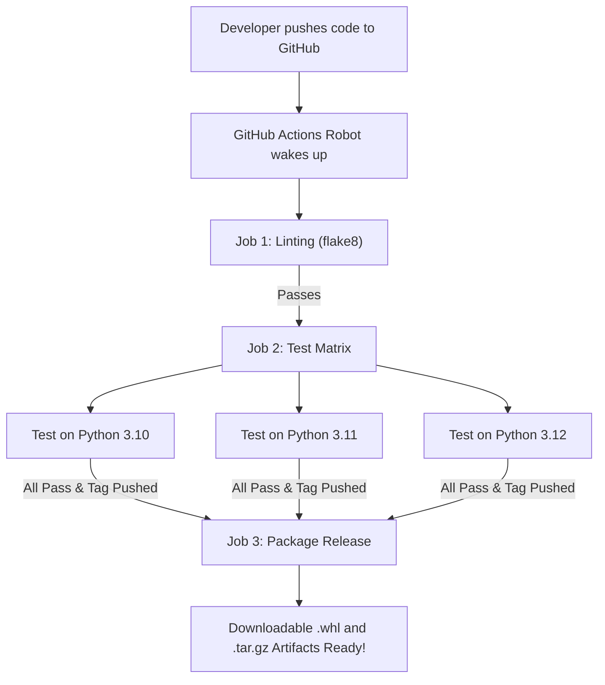

# Zero to Hero: Master Git, GitHub, Docker & CI/CD
### A Complete, Plain-English Practical Journey from Absolute Beginner to Industry Expert

Welcome! If you are completely new to **Git, GitHub, Docker, and CI/CD**, this guide was created specifically for you.

We will not use confusing jargon without explaining it first. Everything is explained with intuitive real-world metaphors, practical step-by-step commands, and the exact hands-on project already waiting in your workspace: **`git-cicd-retail-hub`**.

---

## 🗺️ The 5-Stage Learning Roadmap

```
  ┌─────────────────────────────────────────────────────────────┐
  │ STAGE 1: Git Foundations (Local Version Control)            │
  │ • The "Time Machine" of code                                │
  │ • Working Directory -> Staging Area -> Commit History       │
  │ • Commands: status, add, commit, diff, log, restore         │
  └──────────────────────────────┬──────────────────────────────┘
                                 │
                                 ▼
  ┌─────────────────────────────────────────────────────────────┐
  │ STAGE 2: GitHub & Team Collaboration                        │
  │ • The Cloud Workspace                                       │
  │ • Feature Branching, Pull Requests (PRs), and Code Reviews  │
  │ • Commands: remote, push, pull, switch, merge, conflict     │
  └──────────────────────────────┬──────────────────────────────┘
                                 │
                                 ▼
  ┌─────────────────────────────────────────────────────────────┐
  │ STAGE 3: CI/CD Automation with GitHub Actions               │
  │ • The "Automated Quality Inspector"                         │
  │ • Workflows, Matrix Testing, Linting & Release Packaging    │
  │ • Files: .github/workflows/ci-cd.yml                        │
  └──────────────────────────────┬──────────────────────────────┘
                                 │
                                 ▼
  ┌─────────────────────────────────────────────────────────────┐
  │ STAGE 4: Docker & Containerization                          │
  │ • The "Standard Shipping Container" for Software            │
  │ • Solving "It works on my machine" forever                  │
  │ • Files: Dockerfile, .dockerignore, docker-compose.yml      │
  │ • Cloud Build with Azure ACR (No local Docker needed!)      │
  └──────────────────────────────┬──────────────────────────────┘
                                 │
                                 ▼
  ┌─────────────────────────────────────────────────────────────┐
  │ STAGE 5: Production Deployment                              │
  │ • Deploying Container to Azure Container Apps (ACA)         │
  │ • Automated Git Push -> CI Test -> Cloud Deploy             │
  └─────────────────────────────────────────────────────────────┘
```

---

## 📖 STAGE 1: Git Foundations (Local Version Control)

### The Real-World Metaphor: The Document Time Machine
Before Git, people saved files like this:
- `project.py`
- `project_v2.py`
- `project_final.py`
- `project_final_FINAL_FOR_REAL.py`

If something broke, you had no idea what changed, who changed it, or how to go back.
**Git is a Time Machine.** Every time your code is in a working state, you take a **snapshot (Commit)**. You can freely experiment, and if anything goes wrong, you can rewind time to any previous snapshot with one command.

---

### The 3 Areas of Git: The Desk, The Envelope, and The Filing Cabinet

```
┌──────────────────────┐         git add          ┌──────────────────────┐        git commit        ┌──────────────────────┐
│  Working Directory   │ ───────────────────────► │     Staging Area     │ ───────────────────────► │   Local Repository   │
│     (Your Desk)      │                          │     (The Envelope)   │                          │ (The Filing Cabinet) │
│ Unstaged, raw files  │ ◄─────────────────────── │  Drafted snapshot    │ ◄─────────────────────── │ Permanent snapshots  │
└──────────────────────┘        git restore       └──────────────────────┘        git reset         └──────────────────────┘
```

1. **Working Directory (Your Desk)**: The actual files you are typing on disk (`src/retail_calc.py`).
2. **Staging Area (The Envelope)**: You choose which specific changes you want to pack into the next snapshot.
3. **Local Repository (The Filing Cabinet)**: When you seal the envelope (`git commit`), it is stored permanently in the `.git/` database on your machine.

---

### Hands-On Practice (Try in your terminal right now!):

Open terminal and enter your project folder:
```bash
cd c:\Users\2869026\Desktop\visual\git-cicd-retail-hub
```

#### Command 1: `git status` — What is happening right now?
```bash
git status
```
*What it tells you*: Are there unsaved edits on your desk? Are files ready in the envelope? What branch are you standing on?

#### Command 2: `git diff` — What did I change?
Open `src/retail_calc.py` and change a number or add a comment. Then run:
```bash
git diff
```
*What it tells you*: Shows green lines (`+`) for what you added and red lines (`-`) for what you removed.

#### Command 3: `git add <file>` — Put into the envelope
```bash
git add src/retail_calc.py
```
*What it tells you*: Moves the modified file from your desk into the staging envelope.

#### Command 4: `git commit -m "..."` — Seal and save snapshot
```bash
git commit -m "feat: update retail discount calculation"
```
*What it tells you*: Permanently stamps this snapshot into history with a message explaining what changed.

#### Command 5: `git log --oneline --graph` — Look through history
```bash
git log --oneline --graph
```
*What it tells you*: Displays a visual timeline of all snapshots ever taken in the project.

---

## 🌐 STAGE 2: GitHub & Team Collaboration

### What is GitHub?
If **Git** is the camera on your local computer, **GitHub** is the online cloud gallery where you and your team share photos.

---

### The Professional Feature Branch Workflow
In a company, developers **never work directly on the `main` branch**. If you make a mistake on `main`, production goes down!

Instead, we use **Branches**:

```
main branch         ●──────────────────●──────────────────────● (Merged!)
 (Production)                           \                    /
                                         \                  /
feature branch                            ●────────●───────●
 (Your safe workspace)                     Write   Test    PR Review
```

#### Hands-On Branching Steps:

1. **Create your safe workspace**:
   ```bash
   git switch -c feature/add-florida-tax
   ```
   *Now any code you write is 100% isolated. The production `main` branch cannot be broken.*

2. **Write code and commit on your branch**:
   Edit `src/retail_calc.py`, then:
   ```bash
   git add src/retail_calc.py
   git commit -m "feat: add Florida state sales tax"
   ```

3. **Push your branch to GitHub**:
   ```bash
   git push -u origin feature/add-florida-tax
   ```

4. **Open a Pull Request (PR) on GitHub**:
   - A Pull Request is an invitation: *"Hey team, I finished this feature on my branch. Please review my code and merge it into main when ready!"*
   - Teammates can see your diff line-by-line, leave comments, and approve.
   - You click **"Merge pull request"** on GitHub.

5. **Bring the merged code back to your local computer**:
   ```bash
   git switch main
   git pull origin main
   ```

---

## ⚙️ STAGE 3: CI/CD Automation with GitHub Actions

### What is CI/CD?
- **CI (Continuous Integration)**: The automated quality inspector. Every time code is pushed or a PR is opened, an automated robot automatically downloads the code, runs linting checks, and runs unit tests. If tests fail, it blocks the PR from merging!
- **CD (Continuous Delivery / Deployment)**: If all tests pass, the robot automatically packages the software and deploys it to the cloud.

---

### How it works in our project (`.github/workflows/ci-cd.yml`):



### The 3 Core Concepts of GitHub Actions:
1. **Trigger (`on:`)**: What makes the robot wake up? (`push`, `pull_request`, or `release`).
2. **Runner (`runs-on: ubuntu-latest`)**: A clean, temporary virtual machine provided by GitHub in the cloud.
3. **Step (`run: python -m unittest ...`)**: The exact terminal commands the robot runs inside the virtual machine.

---

## 🐳 STAGE 4: Docker & Containerization

### What problem does Docker solve?
Have you ever heard a programmer say:
> *"It works on my computer, why doesn't it work on the server?!"*

Maybe their laptop has Python 3.11 installed, but the server has Python 3.8. Or maybe a required library is missing.

**Docker solves this by packaging the code AND the entire operating system environment together into a single lightweight "Shipping Container".**
If it runs in the container, it will run identically on Windows, Mac, Linux, AWS, or Azure!

---

### The Anatomy of our `Dockerfile`:

```dockerfile
# 1. Base Operating System Image
FROM python:3.11-slim

# 2. Working folder inside the container
WORKDIR /app

# 3. Copy dependencies and install them
COPY requirements.txt .
RUN pip install --no-cache-dir -r requirements.txt

# 4. Copy our project code into the container
COPY src/ ./src/

# 5. Expose HTTP port 8000
EXPOSE 8000

# 6. The command to run when the container starts
CMD ["uvicorn", "src.main:app", "--host", "0.0.0.0", "--port", "8000"]
```

---

### Cloud Docker Build (No local Docker installation required!)
Since your Windows computer doesn't currently have Docker Desktop installed, you have an enterprise superpower available: **Azure Container Registry (ACR) Cloud Build**!

In your Azure resource group `rg-explore-ai`, you already have:
`acrexploreai65064.azurecr.io`

With **one command**, Azure compiles your Dockerfile in the cloud and stores your container image:
```bash
az acr build --registry acrexploreai65064 --image retail-pricing-engine:v1 .
```
*Azure spins up a cloud container builder, installs dependencies, builds your image, and tags it—with zero local Docker installation needed!*

---

## 🚀 STAGE 5: Cloud Deployment & The Full Pipeline

Once the container image is in Azure Container Registry (`acrexploreai65064`), deploying it is a single Azure command to **Azure Container Apps (ACA)**:

```bash
az containerapp create \
  --name retail-pricing-api \
  --resource-group rg-explore-ai \
  --environment cae-explore-ai \
  --image acrexploreai65064.azurecr.io/retail-pricing-engine:v1 \
  --target-port 8000 \
  --ingress external
```

### The Ultimate End Goal You Are Learning:
```
You write 1 line of code locally
             │
             ▼ git commit & git push
GitHub receives code
             │
             ▼ GitHub Actions triggers
Automated tests pass on Python 3.10, 3.11, 3.12
             │
             ▼ Automated Docker Build
Pushed to Azure Container Registry
             │
             ▼ Automated Cloud Deploy
Live API updated on the internet with zero downtime!
```

---

## 🎯 Your Immediate Action Plan (To start right now!)

1. **Step 1**: Read and follow the interactive lab in [**`GIT_PRACTICE_WORKFLOW_LAB.md`**](file:///c:/Users/2869026/Desktop/visual/git-cicd-retail-hub/GIT_PRACTICE_WORKFLOW_LAB.md).
2. **Step 2**: Create an empty repo on **[GitHub.com](https://github.com)** and push your `main` branch.
3. **Step 3**: Watch the **Actions** tab on GitHub run your test suite live!
4. **Step 4**: When you are comfortable with pushing and PRs, let's execute the Azure ACR Cloud Docker build together!
